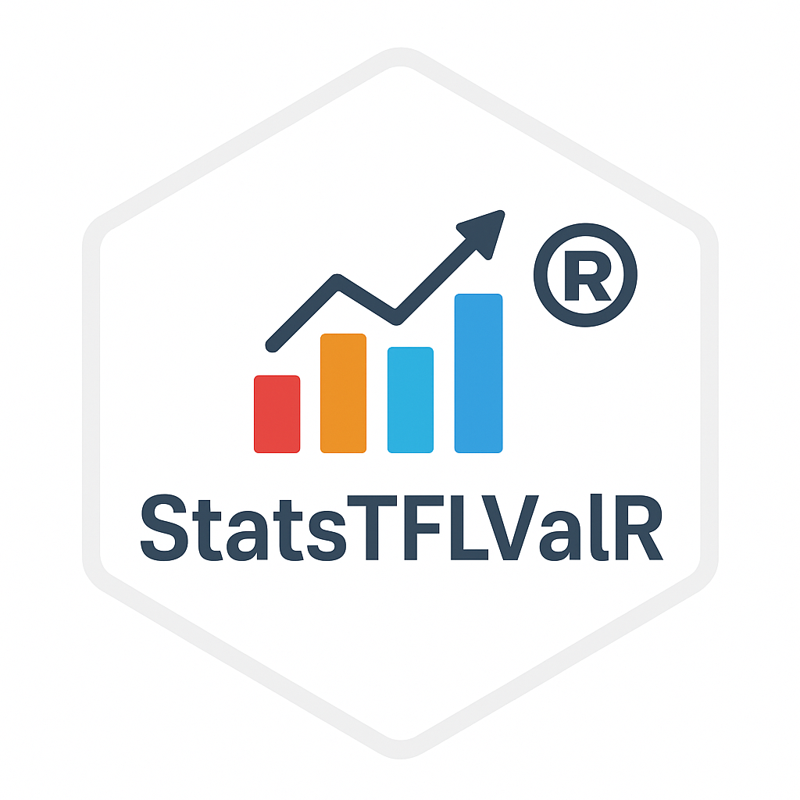

# StatsTFLValR 

<!-- Badges -->
<!-- Replace username with your GitHub ID -->

[](LICENSE)
[](https://github.com/kalsem/StatsTFLValR/issues)

***

## Overview

**StatsTFLValR** is an R package providing **reusable, audit-ready utilities for validation of clinical trial datasets and outputs**.  
It is designed to support **dataset review, comparison, counting, and table-level verification** commonly required in regulated statistical programming workflows.

The package emphasizes:

- Standardization and reproducibility  
- Transparent validation logic  
- Clear, review-friendly outputs  
- Integration with controlled and GxP-aligned programming environments  

**StatsTFLValR** is intended for use by Statistical Programmers, Statisticians, and validation reviewers.

***

# Key Features

## Scope and Capabilities

### 🔹 Data Ingestion and Metadata Utilities
- **`get_data()`** – Load datasets from multiple formats (XPT, SAS, CSV, RDS) with validation and duplicate-file checks  
- **`get_column_info()`** – Extract variable-level metadata (names, types, labels) for dataset inspection and documentation  

***

### 🔹 Frequency, Counts, and Summary Utilities
- **`freq_by()`** – Grouped subject counts and percentage summaries  
- **`freq_by_line()`** – Line-level frequency summaries for table-ready outputs  
- **`mean_by()`** – Grouped descriptive statistics (mean, median, quantiles)  
- **`sas_round()`** – SAS-style rounding utility for consistent percentages  

***

### 🔹 Table-Building Functions
- **`SOCbyPT()`** – SOC–PT–level adverse event summaries  
- **`SOCbyPT_Grade()`** – SOC–PT adverse event tables with toxicity grade splits  
- **`ATCbyDrug()`** – Fully nested ATC-based concomitant medication summaries  

Built-in ordering, indentation, and formatting logic is designed to support **TFL validation and QC review**.

***

### 🔹 Dataset and Output Comparison
- **`generate_compare_report()`** – PROC COMPARE–style dataset comparison utility  
  - Identifies added, deleted, and modified records  
  - Compares variable attributes and values  
  - Produces structured, review-ready outputs  

***

### 🔹 Supporting Infrastructure
- Centralized global variable declarations (`globals.R`) to support CRAN checks  
- Internal helper utilities (`ps_helpers.R`) reused across functions to ensure consistent behavior  

***

## Function Index

The following functions are currently exported in **StatsTFLValR**:

- `get_data()` – Multi-format dataset loading  
- `get_column_info()` – Variable-level metadata extraction  
- `freq_by()` – Grouped N (%) summaries  
- `freq_by_line()` – Line-level frequency summaries  
- `mean_by()` – Grouped descriptive statistics  
- `sas_round()` – SAS-style rounding utility  
- `SOCbyPT()` – SOC–PT AE table generation  
- `SOCbyPT_Grade()` – SOC–PT AE tables with grade splits  
- `ATCbyDrug()` – ATC-based medication summaries  
- `generate_compare_report()` – Dataset comparison (PROC COMPARE–style)  

***

## Capability → Function Mapping

| Capability Area                   | Function(s)                                | Typical Use Case |
|----------------------------------|---------------------------------------------|------------------|
| Dataset loading                  | `get_data()`                                | Load datasets for review and QC |
| Metadata inspection              | `get_column_info()`                         | Variable-level dataset inspection |
| Frequency summaries              | `freq_by()`, `freq_by_line()`               | N (%) table validation |
| Descriptive statistics           | `mean_by()`                                 | Summary statistics QC |
| AE table validation              | `SOCbyPT()`, `SOCbyPT_Grade()`              | SOC–PT AE tables |
| Concomitant medication summaries | `ATCbyDrug()`                               | ATC-based summaries |
| Dataset comparison               | `generate_compare_report()`                 | Developer vs validator comparison |
| Rounding consistency             | `sas_round()`                               | SAS-aligned rounding |

***
## Installation

### You can install the released version of StatsTFLValR from CRAN:

```r
install.packages("StatsTFLValR")  

or 

install.packages("StatsTFLValR", dependencies = TRUE)

```

### Install the development version from GitHub

```r
# install.packages("remotes")
remotes::install_github("kalsem/StatsTFLValR")
```

### Verify installation

```r
library(StatsTFLValR)
packageVersion("StatsTFLValR")
```

***

## Usage

### Load the package:

```r
library(StatsTFLValR)
```

Access function-level documentation:

```r
?freq_by
?generate_compare_report
```

A PDF reference manual is available in the GitHub repository.
📄 [Download StatsTFLValR PDF Manual](https://github.com/kalsem/StatsTFLValR/blob/main/docs/StatsTFLValR_1.0.0.pdf)
***

## Package Status

**Lifecycle:** Experimental

Under active development

Interfaces and behavior may change in future releases

Bug reports and enhancement requests can be submitted via GitHub issues.

***

## License

This package is licensed under the MIT License.
See the LICENSE file for details.

***

## Disclaimer

This package is provided as a supporting utility and does not replace formal validation or quality control processes.  
Use of this package does not imply compliance with regulatory requirements.
Users are responsible for ensuring appropriate validation, documentation, and governance in accordance with their internal procedures.


